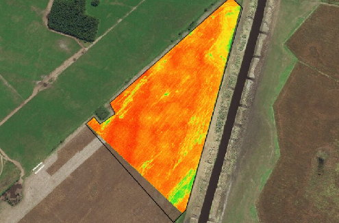

# Carrera de especialización en Inteligencia Artificial
## Procesamiento de Lenguaje Natural

## Deep Learning exam
Colab: [deep_larning_learning_exam](https://github.com/hernancontigiani/AI-Specialization-Projects/blob/main/deep_learning_exam.ipynb)

## Machine Learning exam
\
Study dataset from heart desease. Select best model and optimize with hyperparameter tuning and AI platforms.\
Colab: [machine_learning_exam](https://github.com/hernancontigiani/AI-Specialization-Projects/blob/main/machine_learning_exam.ipynb)

## Computer vision exam
\
Analyze satelital images from farming, use computer vision model for classify fields\
Colab: [computer_vision_learning_exam](https://github.com/hernancontigiani/AI-Specialization-Projects/blob/main/computer_vision_exam.ipynb)

## Natural language processing exam
\

- Vectorizacion
(https://github.com/juanpsch/procesamiento_lenguaje_natural/blob/main/clase_1/ejercicios/1a%20-%20vectorizacion.ipynb)

- Bot de consulta abierta
(https://github.com/juanpsch/procesamiento_lenguaje_natural/blob/main/clase_2/ejercicios/Desafio2.ipynb)

- Custom Embeddings con Gensim
(https://github.com/juanpsch/procesamiento_lenguaje_natural/blob/main/clase_3/ejercicios/Desafio%203.ipynb)

- Predicción de la próxima Palabra
(https://github.com/juanpsch/procesamiento_lenguaje_natural/blob/main/clase_4/ejercicios/Desafio4.ipynb)

- Sentiment analysis con Embeddings + LSTM
(https://github.com/juanpsch/procesamiento_lenguaje_natural/blob/main/clase_5/ejercicios/Desafio%205.ipynb)

- LSTM Bot QA
(https://github.com/juanpsch/procesamiento_lenguaje_natural/blob/main/clase_6/ejercicios/Desaf%C3%ADo6.ipynb)

# Gracias!
Contacto: _juanpsch@gmail.com_ for any doubt.\
Enjoy :smile:!!
